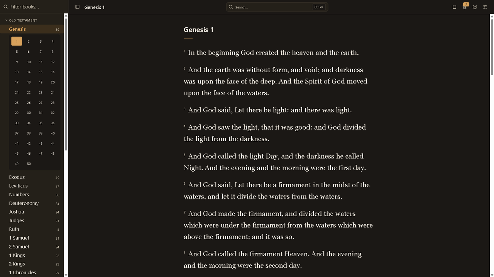
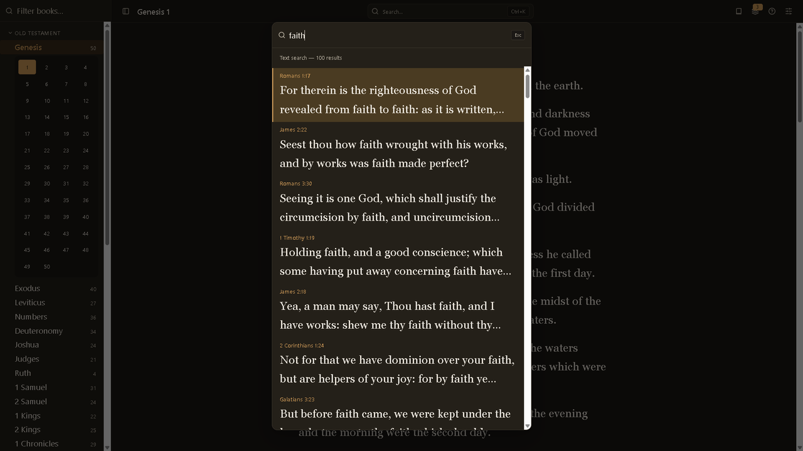
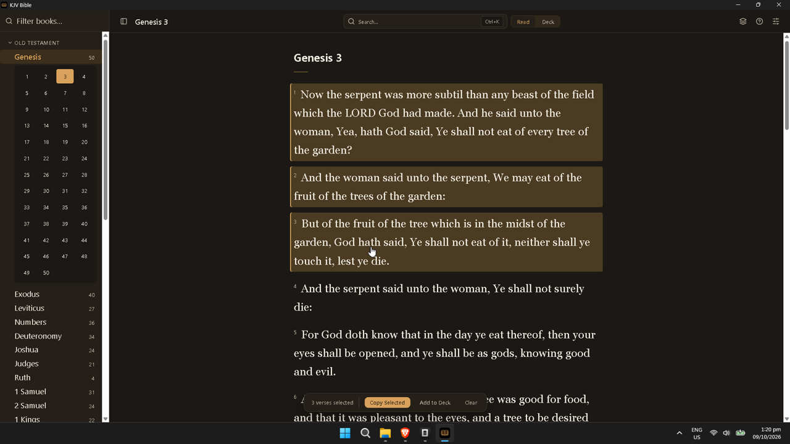
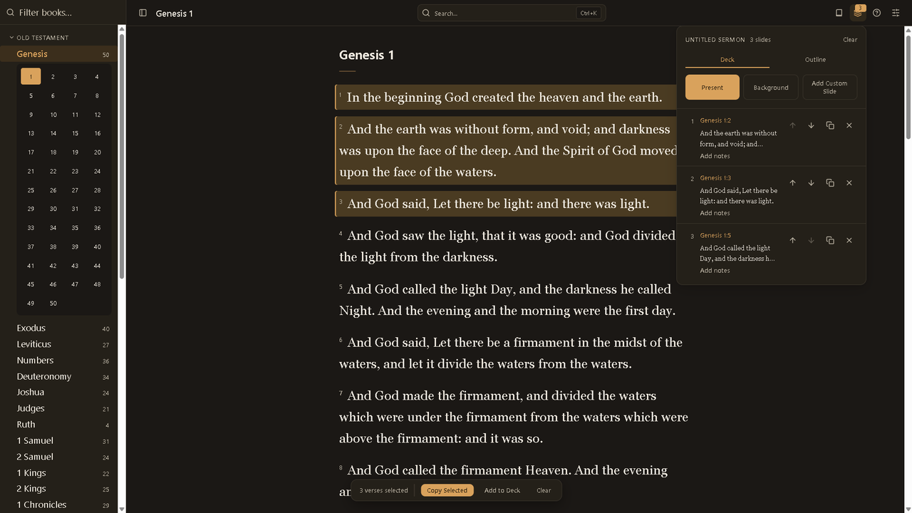
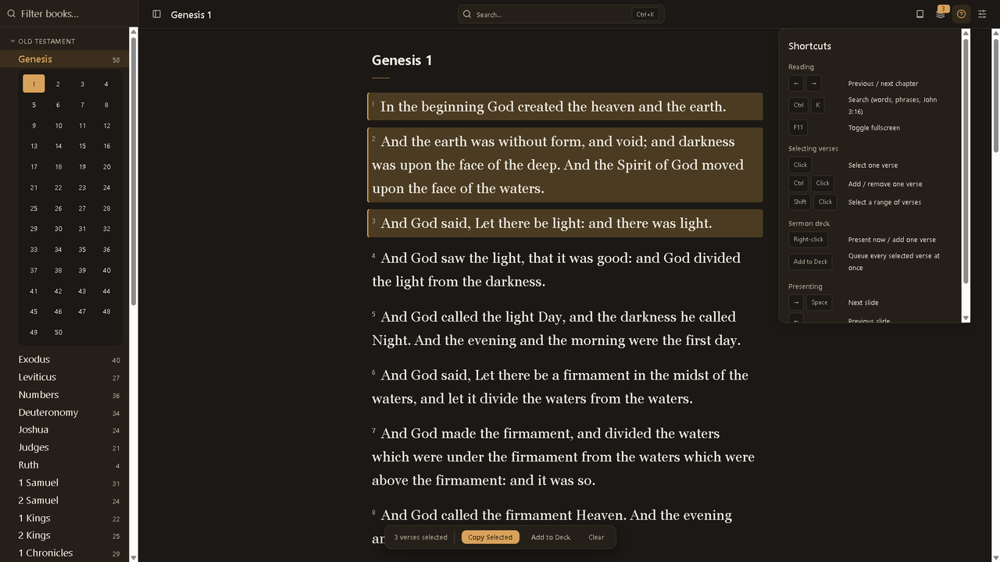

# KJV Bible

A free, fully offline King James Version Bible for Windows. No account, no internet, no ads — just the Bible and tools for studying and preaching. **Free forever:** every feature in this app is free and always will be.

## Download

Go to [**Releases**](https://github.com/DanielPomboDev/kjv-bible-app/releases), download `KJV Bible_1.0.0_x64-setup.exe`, and run it.

## Screenshots

## What you can do

- **Read** all 66 books (31,102 verses). The app reopens where you left off.
- **Search** any word or phrase, or jump straight to a reference like `John 3:16` (`Ctrl+K`).
- **Select verses** with click, `Ctrl+Click`, or `Shift+Click` — then copy them as clean text or queue them all into your sermon deck at once.
- **Assemble the deck** — queue verses, reorder them, duplicate, pick a background.
- **Export to PowerPoint** — download the deck as a `.pptx` and keep designing and presenting in PowerPoint.
- **Adjust** — light/dark theme, reading text size, and a `?` button listing every shortcut.

## Your data

Everything stays on your computer in a single local deck — no account, no sync.

## Help & feedback

Found a bug or want a feature? [Open an issue](https://github.com/DanielPomboDev/kjv-bible-app/issues).

## Support this work

KJV Bible is free forever. If it blesses you, consider a donation to fund new features: ☕ [ko-fi.com/devdandan](https://ko-fi.com/devdandan).

---

*For developers: run `npx tauri dev` after `npm install`; build with `npx tauri build`.*
